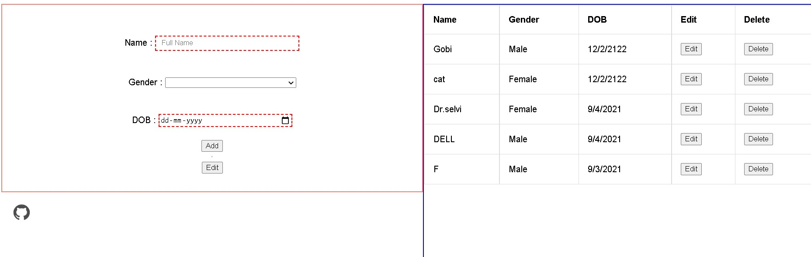

# Student Database Management

This is a CURD -> "Create, Update, Read and Delete." operations website with student details like Name, Gender, and Date of Birth.

### Frame work and Database Used
   #-> React, Node, and MySQL

